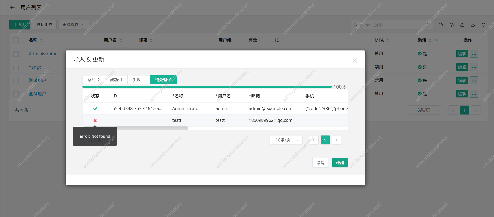
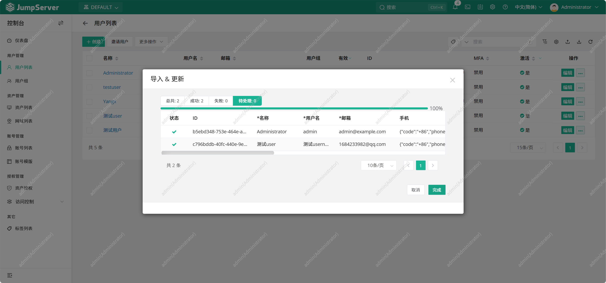

# 一阶段培训总结报告（Report.md）

## 一、学习内容总结

### 1. 客户成功与组织认知 3.30

- 了解公司整体业务架构及组织结构
- 明确客户成功岗位职责及工作场景
- 熟悉公司价值体现：Fast Software 理念

------

### 2. JumpServer 产品学习 3.30

围绕 JumpServer 核心功能进行了学习并简单实操

同时完成：

- 单节点堡垒机环境搭建
- 官方文档的阅读

------

### 3. 文档与工具链能力 3.31

#### Markdown 语言的学习

- 掌握基本语法

#### Git工具基础命令学习

- git clone / add / commit / push
- 分支创建与切换（main / dev）
- 基础协作流程理解（PR / Merge）

------

### 4. 遇到的问题
#### 问题1：
<html> <head><title>502 Bad Gateway</title></head> <body> 
<h1>502 Bad Gateway</h1>
 

nginx
 </body> </html> <!-- a padding to disable MSIE and Chrome friendly error page --> <!-- a padding to disable MSIE and Chrome friendly error page --> <!-- a padding to disable MSIE and Chrome friendly error page --> <!-- a padding to disable MSIE and Chrome friendly error page --> <!-- a padding to disable MSIE and Chrome friendly error page --> <!-- a padding to disable MSIE and Chrome friendly error page -->
排错思路：  

    1. 查看错误日志cat /data/jumpserver/core/data/logs/jumpserver.log
> root@yangx-virtual-machine:/opt/jumpserver-ee-v4.10.16-x86_64# cat /data/jumpserver/core/data/logs/jumpserver.log
2026-04-02 09:26:38 [ERRO] pid 87 thread <Thread(debouncer_3, started daemon 136858586572480)> delay run update_user_last_used error: connection to server at "postgresql" (192.168.250.8), port 5432 failed: No route to host
问题定位显示JumpServer无法访问内置 PostgreSQL 容器  

    2. 检查服务状态，执行命令jmsctl status确认组件运行状态
    3. 执行命令 jmsctl restart postgresql 尝试重启服务

#### 问题2

用户更新导入失败，报错显示error:not found（尝试创建用户 成功）  
经过多次修改表格尝试后，定位到问题所在：对创建/更新的逻辑有误。创建用户不需要填写ID而更新用户是在旧用户的基础上进行更新，需要具体系统生成的ID。

## 二、阶段成果

- 完成 JumpServer 单节点部署实践
- 学习 Markdown 技术文档编写
- 掌握 Git 基础使用流程
